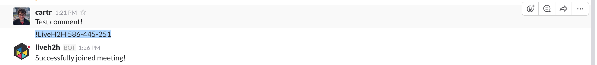

LiveH2H Slackbot
================

This is code for a minimum viable product slackbot for liveh2h.

# Installation

```sh
$ npm install
```

# Get API Token and Setup Environment

Create a slackbot API token from [this link](https://api.slack.com/docs/oauth-test-tokens) and set it to the environment variable.

```sh
$ export SLACKBOT_API_TOKEN="YOUR API Token"
```

# Start Server

```sh
$ npm start
```

Once your server has started setup initialize your slackbot into your liveh2h session by using `!LiveH2H H2H Session`




Now all chat sessions from this liveh2h session will be updated in realtime on slack!
